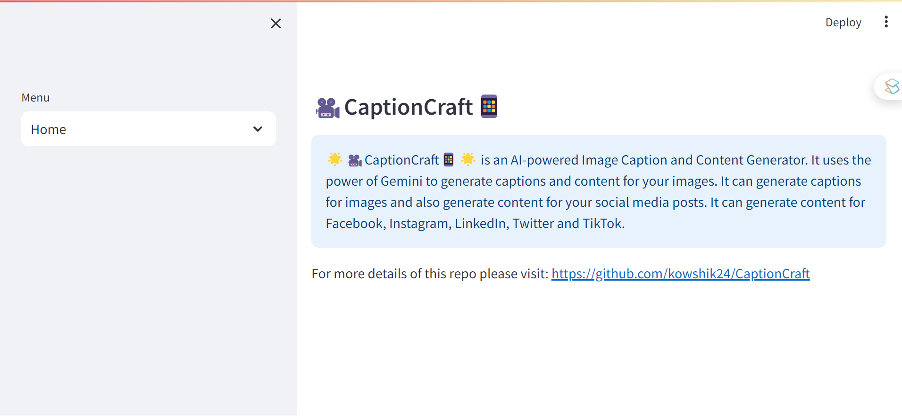
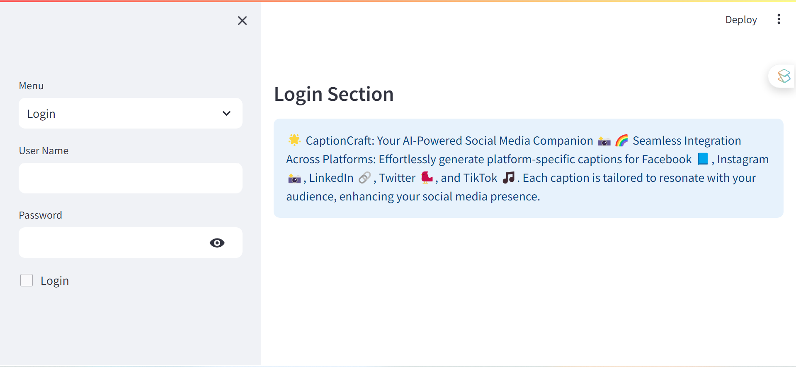
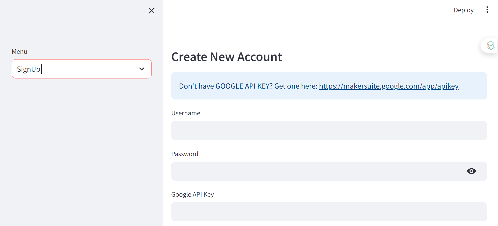
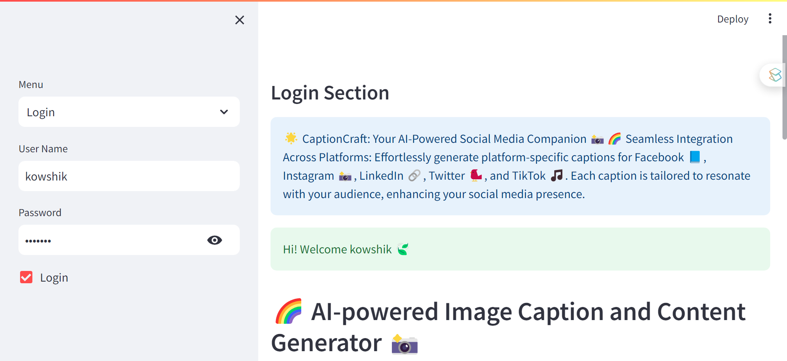
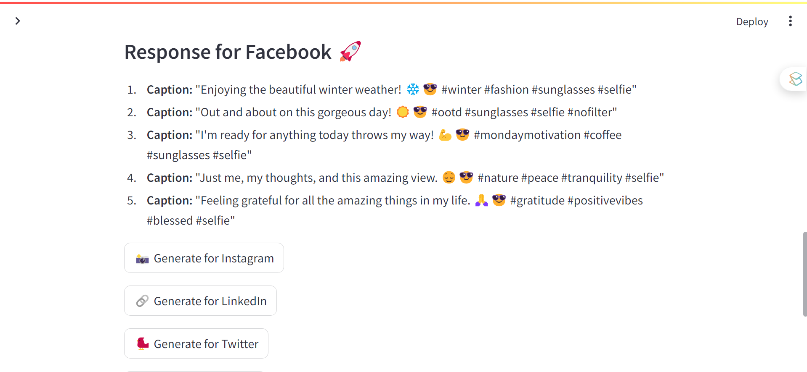
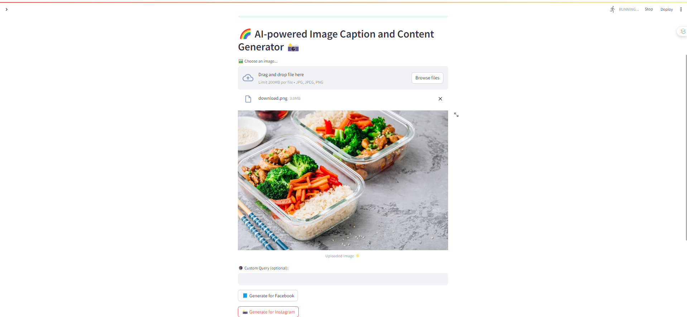
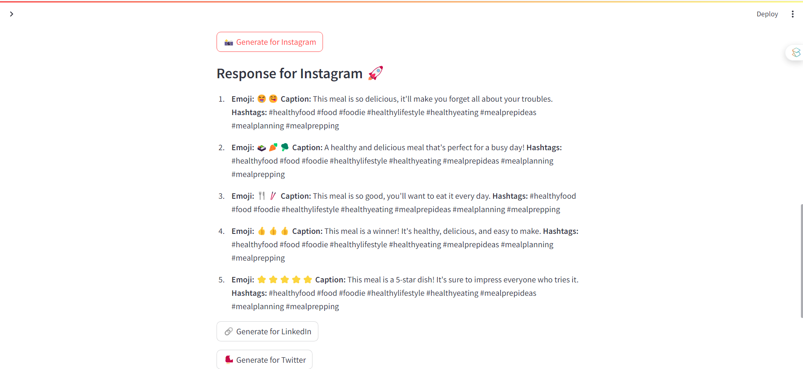

# 🌟 CaptionCraft: AI-Powered Image Caption Generator 📸
## 🌈 Overview

CaptionCraft is an innovative 🚀 application that leverages AI 🤖 to generate captivating captions for images 🖼️. Designed for social media enthusiasts 📱, digital marketers 📊, and content creators 🎨, this tool offers a quick and efficient way to create engaging captions for platforms like Facebook 📘, Instagram 📸, LinkedIn 🔗, Twitter 🐦, and TikTok 🎵.


## 🛠️ Features
1. **📝 Platform-Specific Caption Generation:** Generate customized captions for different social media platforms with just a click.
2. **✍️ Custom Caption Option:** Flexibility to input custom prompts for more personalized captions.
3. **👁️ User-Friendly Interface:** Streamlined and visually appealing interface for an intuitive user experience.
4. **🔥 Powered by Google's Generative AI:** Utilizes advanced AI models for high-quality and contextually relevant captions.

📹 Demo and Screenshots
👆 Click on the image above to view the demo video.
👇 Scroll down for screenshots of the application.
📸 Screenshots
Caption generation interface

|  |  |
|:--------------------------------:|:--------------------------------:|
|     **Sample Visualization 1**   |     **Sample Visualization 2**   |
|  |  |
|     **Sample Visualization 3**   |     **Sample Visualization 4**   |
|  |  |
|     **Sample Visualization 5**   |     **Sample Visualization 6**   |
|  |  |
|     **Sample Visualization 7**   |  |


## 📘 How to Use
1. **🚀 Start the Application:** Run the app using Streamlit with the command streamlit run app.py.
2. **📤 Upload an Image:** Choose an image for which you need a caption.
3. **👇 Choose a Platform or Enter a Custom Prompt:** Select one of the platform-specific buttons for an auto-generated prompt or enter your custom prompt.
4. **🔥 Generate Caption:** Click on the 'Generate' button to receive your caption.
5. **✏️ Customize and Share:** Use the generated captions directly on your social media or tweak them as needed.


## ⚙️ Installation and Setup
To set up CaptionCraft, follow these steps:

Clone the repository: 
```bash
git clone https://github.com/kowshik24/CaptionCraft.git
```
Install the required packages:
```bash 
pip install -r requirements.txt
```
Run the Streamlit app: 
```bash
streamlit run app.py
```
Ensure you have an API key for Google's Generative AI and place it in a .env file as 
```bash
GOOGLE_API_KEY=your_api_key_here.
```
📞 Contact Information
For support, feedback, or contributions, please reach out to:

- 📧 **Email**: [kowshikcseruet1998@gmail.com](mailto:kowshikcseruet1998@gmail.com)
- 📱 **Phone**: 01706 896161
- 🌐 **Website**: [https://kowshik24.github.io/kowshik.github.io/](https://kowshik24.github.io/kowshik.github.io/)
- 🚀 **GitHub**: [Kowshik Deb Nath](https://github.com/kowshik24)
- 🤝 **LinkedIn**: [Kowshik Deb Nath](https://www.linkedin.com/in/kowshik-deb-nath-7a0a3a1a0/)
---
